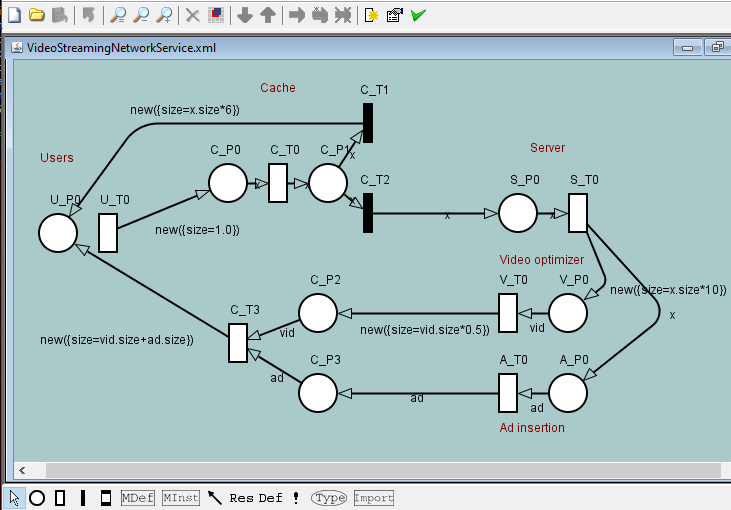
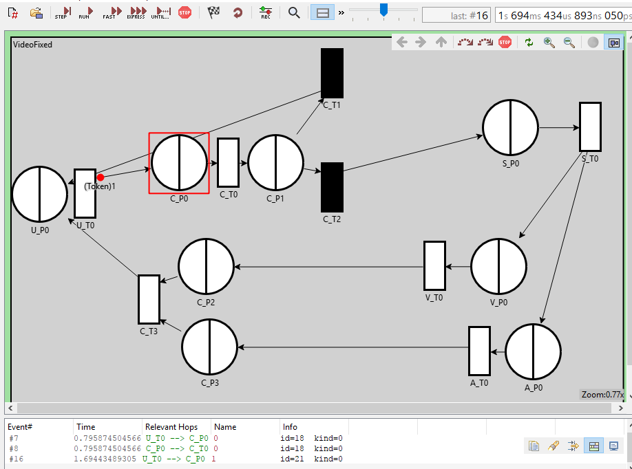
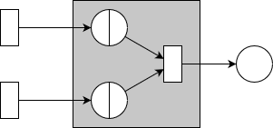

# Network service simulation compiler

The compiler generates OMNeT++ simulation code for simulating and analyzing the behavior of a specified NFV network service. The network service needs to be specified precisely as Queuing Petri Net (QPN), using TimeNet.

This automated workflows enables fast and easy, yet accurate analysis of network services, providing valuable insights into their behavior and performance.

## Installation requirements

* [Pyhton 3.6](https://www.python.org/) for the automatic compilation and generation of OMNeT++ simulation code
* [OMNeT++ 5.2](https://omnetpp.org/) to execute the generated simulation code
* [TimeNet 4.4](https://timenet.tu-ilmenau.de/template/index) to specify new network services as Queuing Petri Nets

To install all requirements for running the evaluation Jupyter notebooks, use the `requirements.txt`:

```bash
pip install -r requirements.txt
```

## Usage/Execution workflow

For simulation compilation, simply run `python main.py <service.xml>`, where `<service.xml` is the specified network service as xml file.

Here is the complete workflow of specification, compilation, and simulation:

1. Specify the network service and the behavior of involved virtual network functions (VNFs) as Queuing Petri Net (QPN) using TimeNet 4.4. Copy the resulting xml file of the specified network service into the `xml-files` directory. There are already multiple examples, so you can skip this step if you just want to test and experiment with the simulation compiler.
2. Execute `main.py` and specify the name (not the path) of the network service's xml file as command line argument. This triggers the compilation process and creates a new subfolder inside the `autogen` folder with the generated simulation code. The simulation code contains the C++ module implementations, copied from `omnet-base` and generates individual OMNeT++ configuration files corresponding to the specified network service.
3. The generated simulation code can be used directly by OMNeT++ 5.2, by selecting `File > New > OMNET++ Project` inside the OMNeT++ IDE. In the following setup wizard, simply choose a project name and select the generated folder inside `autogen` as location (don't use default!). You can then directly execute and run the `omnet.ini` inside OMNeT++.
   If you just want to test the simulation with OMNeT++, the `omnet-test` contains an already generated/compiled OMNeT++ simulation that you can use.
4. Run the simulation and analyze the results. For example, you can [evaluate the impact of different service configurations on the end-to-end delay](eval/cache_hit_ratio.ipynb) or [investigate bottlenecks in the service](eval/max_rate.ipynb).

### Screenshots

Specification with TimeNet:



Simulation with OMNeT++ GUI (also possible from command line):



## Example/Test

To illustrate and test the compilation process, consider the following very simple example network service (`syncTrans.xml` inside the `xml-files` folder): A single VNF receives requests from two sources. The VNF synchronizes and processes the requests before sending out the merged traffic to an end-point. This simplistic network service can be specified as Queuing Petri Nets as illustrated in the figure below.



This network service is specified in `xml-files/syncTrans.xml`. To compile the corresponding OMNeT++ simulation code, simply run `python main.py syncTrans.xml`. The resulting simulation code is in `autogen/SynctransAuto`.

## Contact

The source code belongs to the paper "Specifying and Analyzing Virtual Network Services Using Queuing Petri Nets" submitted to IFIP/IEEE International Symposium on Integrated Network Management (IM) 2019. The authors are Stefan Schneider, Arnab Sharma, Holger Karl, and  Heike Wehrheim.

Lead developer: Stefan Schneider (@StefanUPB)

For questions or support, please use GitHub's issue system.
